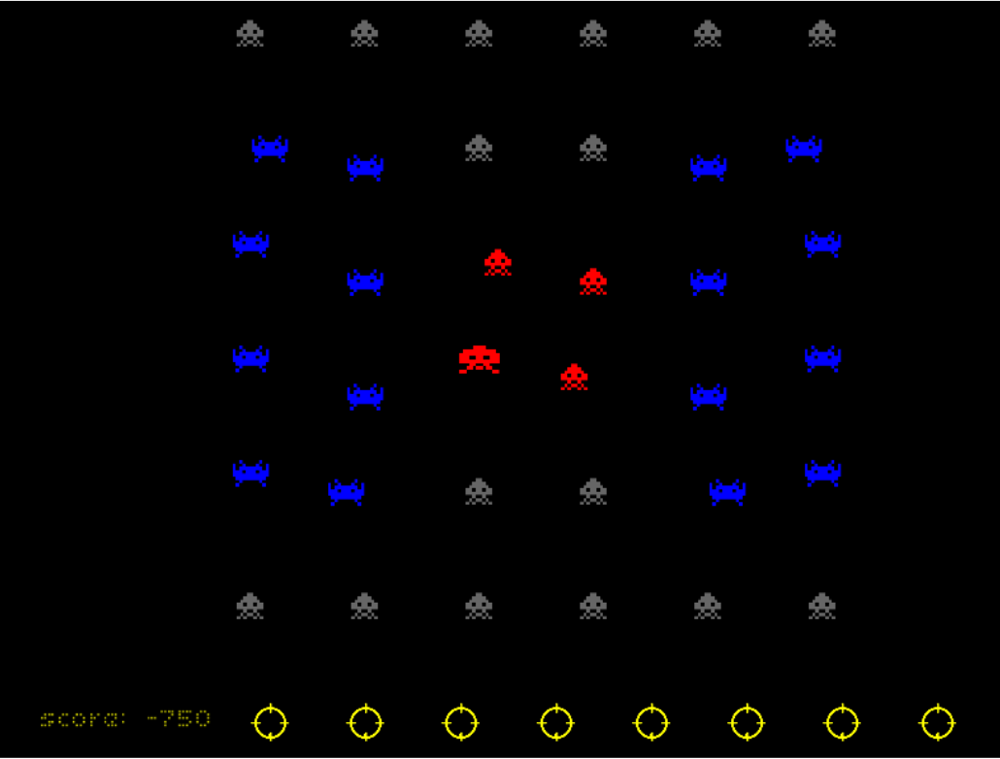

# posts

This project is based on the [work by the Impulse Neiry team](https://habr.com/ru/post/480060/).
We took their approach to preprocessing of EEG data and added several ML-based classification models.

Below is the description from Impulse Neiry's blogpost:

Recent neurotech developments like [Neuralink](https://www.neuralink.com/) and [FastMRI initiative](https://ai.facebook.com/blog/fastmri-releases-neuroimaging-data-set/) brings us to explore the current state of [Brain Computer Interfaces (BCI)](https://en.wikipedia.org/wiki/Brain%E2%80%93computer_interface) field as may be most of our communication with machines will occur only by thought very soon. The most straightforward and simple way to implement the BCI is to use [electroencephalography](https://en.wikipedia.org/wiki/Electroencephalography) - just record electrical potential differences off the scalp and predict internal brain processes by using collected data.

To start with we rely on [P300 Event Related Potential (ERP)](https://en.wikipedia.org/wiki/P300_(neuroscience)) - kind of Evoked Potential (EP) that is related to decision making and stimuli discrimination. We visualize electroencephalogram (EEG) signal, explore ERP structure, build some classifiers and measure their performance.

There are plenty of tutorials on how to build a simple to moderate BCI solution as well as underlying brain mechanics explanation: [BCI2000](https://www.bci2000.org/mediawiki/index.php/User_Tutorial:Introduction_to_the_P300_Response), [Backyard Brains](https://backyardbrains.com/experiments/P300) articles and [Swartz Center video lectures](https://www.youtube.com/playlist?list=PLbbCsk7MUIGcO_lZMbyymWU2UezVHNaMq) to name a few (check them out). But all of them were made significant time ago and most of them use Matlab which nowadays is not widely used by Data Scientists, so we provide a tutorial relying on Python infrastructure.

From Data Scientist point of view, P300 is just a surge in EEG at a certain time in certain brain areas. There are plenty of ways to trigger it, for example, if you concentrate on one stimulus and it gets activated (by changing the colour, shape, brightness or moving a bit) at a random moment. Here is the way this process was implemented at dawn of BCI:

The general scheme is as follows: a person sees a few stimuli (usually from 3 to 7). He chooses one of them and focuses his attention on it (a good way to do it is to count activations) then stimuli get activated one by one in random order. Knowing activation time we could observe chunk of EEG right after the activation and guess if there was P300 present or not. As a person was focusing only on one particular stimulus, therefore there should be only one spike. Thus the current BCI is able to choose one of a few options (letters to spell, actions in a game, etc.). In case we have more than 7 options to choose from they are placed on a grid and choice is reduced to row+column choice. The video above shows the classical implementation of this approach called P300 speller that is used by paralyzed people to communicate.

A visual component used to record today's dataset was derived from a famous game [space invaders](https://en.wikipedia.org/wiki/Space_Invaders). The interface used to look like this

In reality, it's the same P300 speller, with the only difference of letters being replaced by game aliens. Also, [gameplay video](https://www.youtube.com/watch?v=s73l8ZfQcWw) and [technical report](https://arxiv.org/ftp/arxiv/papers/1905/1905.05182.pdf) are available

All in all, we have the data that we can load from the Internet and it contains 16 channels of EEG and one channel of markers indicating starts of both target (chosen by the player) and empty (the rest) stimuli activations.

Most of BCI datasets were recorded by neurophysiologists and these guys usually don't care about compatibility thus formats are quite diverse: from different versions of `.mat` files to "standard" formats [`.edf`](https://en.wikipedia.org/wiki/European_Data_Format) and [`.gdf`](https://en.wikipedia.org/wiki/General_Data_Format_for_Biomedical_Signals). The main thing you need to know is that you don't want to parse all this on your own or work with it directly. Luckily a group of enthusiasts [NeuroTechX](https://neurotechx.com/) wrote loaders for some of the open datasets. These loaders are part of [moabb](https://github.com/NeuroTechX/moabb/) project claiming to standardize BCI solutions.
